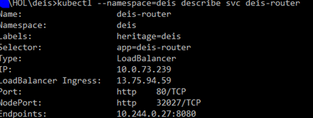
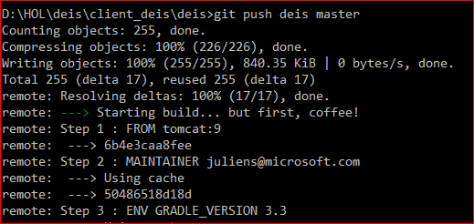
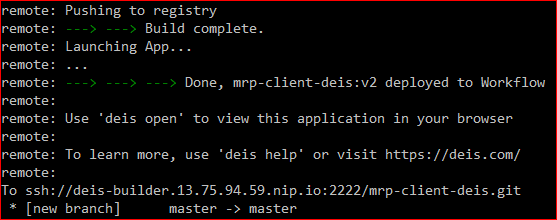
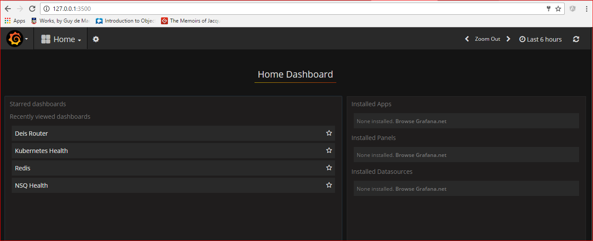

# Deploy, monitor, and scale using Deis Workflow

In this lab learn how to setup Deis Workflow to deploy, monitor, and scale the  Parts Unlimited MRP front-end website to an Azure Container Service cluster.

Workflow is an open source Platform as a Service (PaaS) that adds a
developer-friendly layer to any Kubernetes cluster, making it easy to
deploy and manage applications. For more information, visit official
[deis](https://deis.com/docs/workflow/) documentation

## Prerequisites

Below are prerequisites required to implement Deis.

- Azure Container Service with Kubernetes orchestrator provisioned
- Local client has helm and kubectl installed and able to connect to provisioned ACS cluster
- General understanding of Docker and helm. More information is available in
    [this
    HOL](https://dxdevop.visualstudio.com/mrpmicro/_git/docs?path=%2FHOL1%2FHOL1_readme.md&version=GBmaster&_a=contents).
- [Download](https://github.com/deis/workflow-cli) Deis CLI and set
    the command path

## Tasks Overview

1. Install Deis-Workflow via Helm
1. Register Deis Application
1. Create Deis Application via Dockerfile
1. Scale Application
1. Monitor deis-workflow environment using Grafana

### Task 1: Install Deis-Workflow via Helm

**Step 1.** The Deis-Workflow charts are signed so, keys need to be installed in
order to procced with Helm based Deis-Workflow installation

`curl https://deis.com/workflow/docs/security/1d6a97d0.txt | gpg --import`
    


`gpg --keyserver pgp.mit.edu --recv-keys 1D6A97D0`


**Step 2.** Now add the Deis-Workflow repository to Helm via:

`helm repo add deis https://charts.deis.com/workflow`


**Step 3.** Finally, install Deis workflow onto the ACS cluster via:

`helm install deis/workflow --namespace deis`


### Task 2: Register with the Deis Application

**Step 1.** To use the Deis-Workflow a user needs to be registered using the
load-balancer ip.

The ip details can be found by executing:

`kubectl --namespace=deis describe svc deis-router`



Now copy the [load-balancer-ingress] IP, replace it in the below command, and execute it:

`deis register http://deis.[load-balancer-ingress].nip.io`


After registration user is automatically logged in.

For more information visit this
[link](https://deis.com/docs/workflow/quickstart/deploy-an-app/#register-an-admin-user).

**Step 2.** Logout and Login out of current deis session**

`deis logout`


To log in deis session, copy the [load-balancer-ingress] IP, replace it in the below command, and execute:

`deis login http://deis.[load-balancer-ingress].nip.io`


### Task 3: Create Deis Application from Dockerfile

To create Deis Application from external docker image stored in private
registry execute the following commands. For more details visit following link [Deploy Apps using Workflow](https://deis.com/docs/workflow/quickstart/deploy-an-app/)

Before creating deis application from docker file following conditions
should be met:

1. Repository that is used for cloning should contain only the desired application. In this case following repository is used <https://dxdevop.visualstudio.com/mrpmicro/_git/deis> and the [Clients](<https://dxdevop.visualstudio.com/mrpmicro/_git/code?path=%2FClients&version=GBmaster&_a=contents>) code is placed in the repository.
1. Docker file must be present along with the application code in the repository.

[Read more on the Deis workflow Dockerfile requirements](https://deis.com/docs/workflow/applications/using-dockerfiles/#dockerfile-requirements)

**Step 1.** Review Dockerfile

See how the [Dockerfile](https://dxdevop.visualstudio.com/mrpmicro/_git/deis?path=%2FDockerfile&version=GBmaster&_a=contents) contains the instructions for building the container image which will be created by the [Deis builder](https://deis.com/docs/workflow/understanding-workflow/components/#builder-builder-slugbuilder-and-dockerbuilder).

Installs Gradle

```Bash
curl -fl
https://downloads.gradle.org/distributions/gradle-\${GRADLE\_VERSION}-bin.zip
-o gradle-bin.zip \\
```

Builds the app

```Bash
RUN cd /client && gradle build && dir && mv build/libs/\*
/usr/local/tomcat/webapps/
```

Expose the endpoints and run bash command

```Bash
EXPOSE 8080
ENTRYPOINT catalina.sh run
```

**Step 2.** Add SSH Keys and Clone the git repository where Deis resides

First, generate an SSH Key for use with GitHub or use an existing key.  [SSH keys are required](https://deis.com/docs/workflow/applications/using-dockerfiles/#add-ssh-key) for DEIS to be able to access the git repository even if it is public.

`ssh-keygen -f ~/.ssh/id_deis -t rsa`

Add this key to be able to be used by Deis

`deis keys:add ~/.ssh/id_deis.pub`

Now clone the repository:

`git clone git@github.com:dtzar/pumrp-deis.git`

**Step 3.** Create Deis App

`deis create mrp-client-deis`


**Step 4.** Push the repository to build the Dockerfile and deploy the image

`git push deis master`



…… omitting intermediate logs



**Step 5.** Launch the application deployed to on deis-workflow

`deis open`


### Task 4: Scale Application

The number of process that are executing can be scaled as per the
requirement

`deis scale cmd=2 -a mrp-client-deis`


### Task 5: Monitor deis-workflow environment using Grafana

To monitor log of an application deployed using deis-workflow Grafana
can be used as it installed out of the box with deis-workflow.

Default Port for Grafana is 3500  
Default Username/Password is admin/admin

[Read more on Grafana](https://grafana.com/)

`kubectl get pods --namespace=deis`


`kubectl port-forward deis-monitor-grafana-432627134-w7kd4 3500:3500 --namespace=deis`


### **Dashboards**

Home dashboard



`deis router dashboard`


## Conclusion

This document covers the steps to implement Deis-Workflow on the
Kubernetes infrastructure using “helm” the medium of installation. The
steps to deploy an application over the Deis-Workflow from Docker image
stored in private registry is also illustrated.
